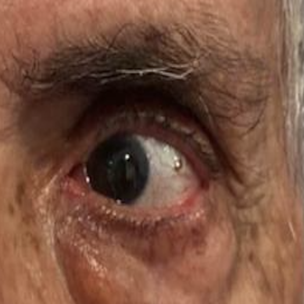
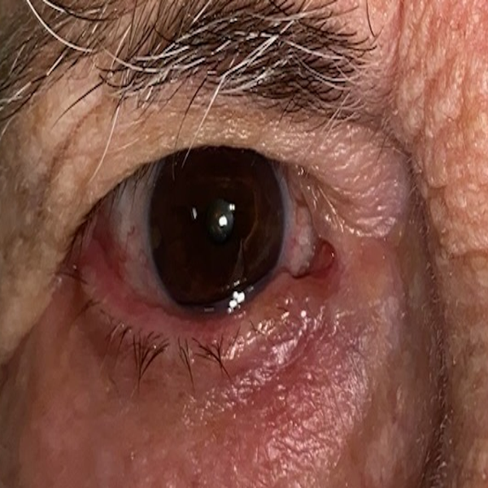

# Can Convolutional Neural Networks help with the detection of sagging eye syndrome?

The following project aims to investigate the potential of Convolutional Neural Networks (CNNs) to assist in the detection of Sagging Eye Syndrome (SES), a prevalent eye disorder that affects the elderly population. SES arises due to the weakening of the muscles that are responsible for elevating the eyelids, leading to drooping of the upper eyelid and causing an indentation in the upper eyelid area. 

The project involves the collection of front view images of the human eye from individuals with age-associated strabismus and those without any ocular syndrome. The acquisition of a large dataset of images enables us to compare and analyze the differences between the two groups. By employing CNNs, we aim to enhance the accuracy of detecting age-associated strabismus.

### Prerequisites

- Install `python3`

- Install `packages`

### Instructions for Setting up the CNN

These are the instructions for installing and configuring the convolutional neural network (CNN) that have been created.

1. Ensure that you have Python 3 installed on your system. If you do not have it, you can download it from the official Python website: https://www.python.org/downloads/

2. Clone the CNN GitHub repository or download the files to your system.

3. Install the necessary dependencies by running the following command in your terminal:

```
pip install -r requirements.txt
```
4. Prepare your eye image dataset and ensure that they are in the appropriate format. The images should be in a separate folder for each class and in the format of the following images:

<div style="display:flex">   </div>

5. If you want to adjust or rescale the input images before running the tests, you can use the save_sq.py script. This script allows you to modify the size, quality, and format of input images to better suit your needs.

6. To view the development of the final chosen model, you can access the `ModeloDropout.ipynb` script. This script contains the code used to develop, train, and test the model.

## Running the tests

We have designed a demo to test our model, which allows users to interact with the model and observe its performance.

There are two ways to try our demo:

1. The first way is to run the main.py script with a specific image file as an argument. This can be done by opening a terminal or command prompt window, navigating to the project directory, and then running any of the following two commands, replacing img.png with the name of the image file you want to use for testing. 
```
python main.py img.png
```
```
python main.py img.png img2.png
```
2. The second way is to run the main.py script without any arguments. This will prompt the user to input the path to the project's designated folder containing the image files for testing purposes. To do this, you would again open a terminal or command prompt window, navigate to the project directory, and then run the command:
```
python main.py
```

## Next Steps

1. To train the model with more data. Our sample is too small
2. Integrate an eye detection model. With that we could use the model with a photo of a full face instead of only an eye.

## Authors

* **Luis Zaldivar Lobato**
* **Pablo Pérez González-Alberto**
* **Andrés Canalejo Oliva**


